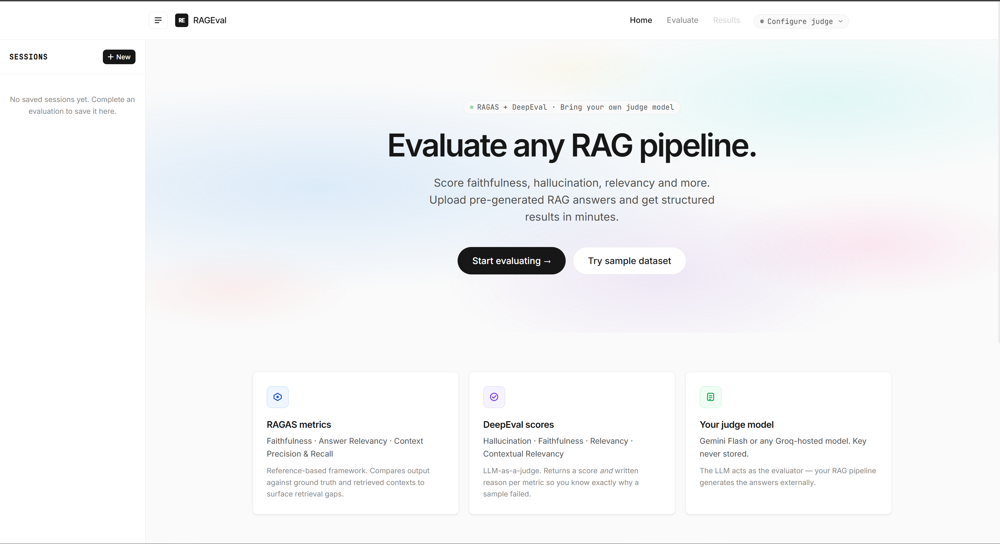
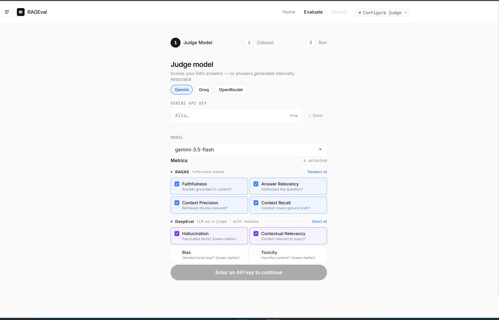
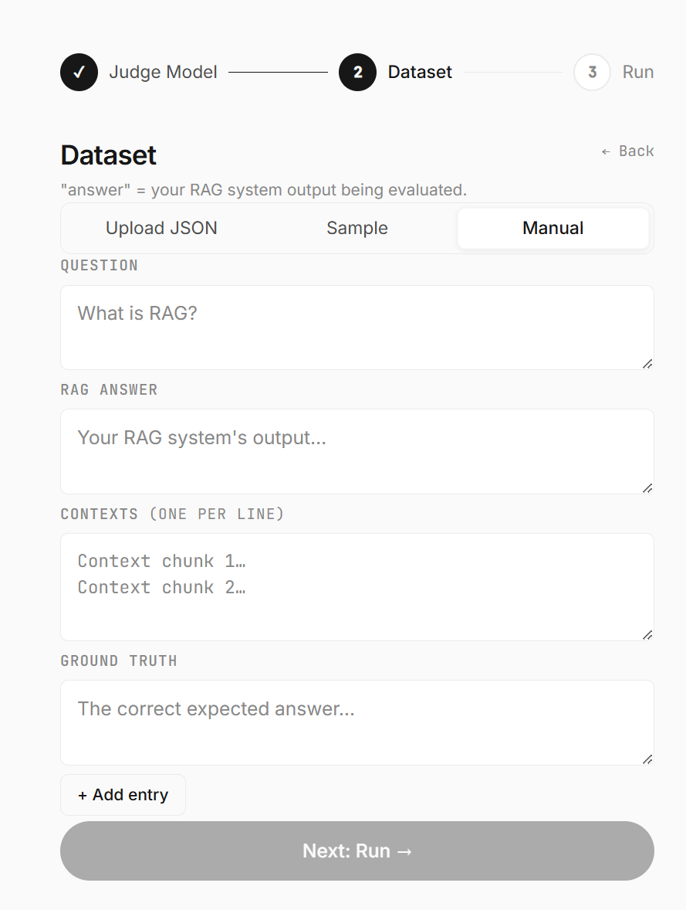
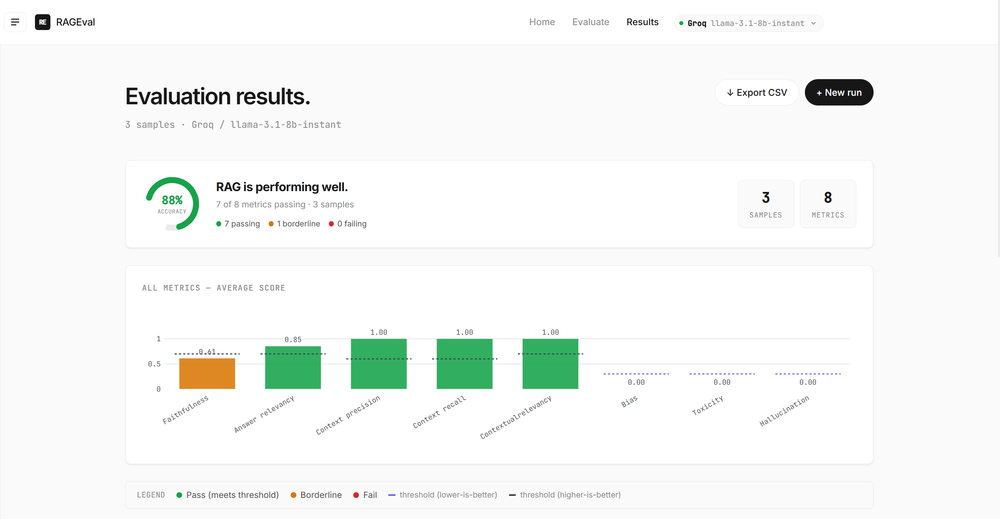
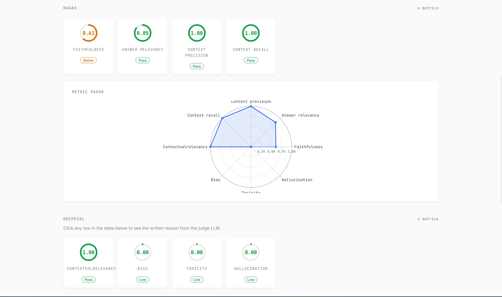
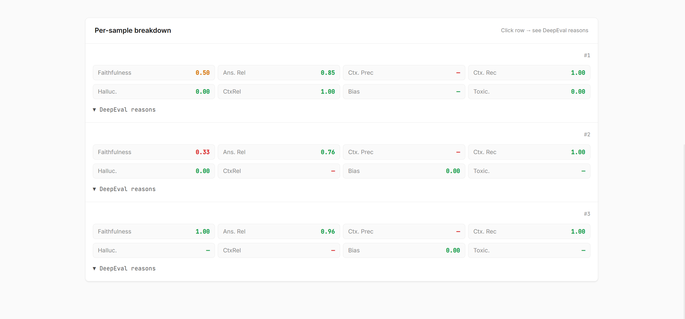

# RAGEval

**Evaluate any RAG pipeline in minutes.** Upload pre-generated answers, pick a judge model, and get structured scores across faithfulness, hallucination, relevancy, and more.

No answer generation happens inside this app — your API key is used only as a judge. It never gets stored.



---

## What it does

You bring the outputs from your RAG system (questions + answers + retrieved contexts + ground truths). RAGEval runs them through **RAGAS** and **DeepEval** side-by-side and gives you a per-metric, per-sample breakdown with charts, radar plots, and exportable CSV.

---

## Screenshots

| Evaluate setup | Dataset input |
|---|---|
|  |  |

| Results overview | Metric breakdown |
|---|---|
|  |  |

**Per-sample breakdown with expandable DeepEval reasons:**



---

## Metrics

| Metric | Framework | What it measures |
|--------|-----------|-----------------|
| Faithfulness | RAGAS | Is the answer grounded in the retrieved context? |
| Answer Relevancy | RAGAS | Does the answer actually address the question? |
| Context Precision | RAGAS | Is the retrieved context relevant to the question? |
| Context Recall | RAGAS | Does the context cover what the ground truth needs? |
| Hallucination | DeepEval | Does the answer contain fabricated facts? |
| Contextual Relevancy | DeepEval | Is the context relevant to the query? |
| Bias | DeepEval | Does the answer carry demographic or political bias? |
| Toxicity | DeepEval | Is the answer toxic or harmful? |

---

## Supported judge providers

| Provider | Key format | Models |
|----------|-----------|--------|
| **Gemini** | `AIza…` | gemini-3.5-flash, gemini-3.1-pro, and more |
| **Groq** | `gsk_…` | Fetched live from Groq API |
| **OpenRouter** | `sk-or-v1-…` | Free-tier models fetched live |

---

## Quick start

```bash
git clone https://github.com/kishan5822/LLM_Evaluation.git
cd LLM_Evaluation

python -m venv venv
venv\Scripts\pip install -r requirements.txt        # Windows
# source venv/bin/activate && pip install -r requirements.txt  # Mac/Linux

venv\Scripts\python -m uvicorn main:app --reload --port 8000
```

Open **http://localhost:8000** — no `.env` file, no config. Enter your API key in the UI.

---

## Dataset format

```json
[
  {
    "question":     "What is retrieval-augmented generation?",
    "answer":       "Output from your RAG system...",
    "contexts":     ["Retrieved chunk 1", "Retrieved chunk 2"],
    "ground_truth": "The correct expected answer"
  }
]
```

Upload as JSON, enter manually, or load the built-in sample dataset to try it right away.

---

## Architecture

```
Your RAG system outputs (JSON)
         ↓
   RAGEval Dashboard
         ↓
  ┌──────────────┐   ┌──────────────┐
  │    RAGAS     │   │   DeepEval   │
  │  4 metrics   │   │  4 metrics   │
  └──────────────┘   └──────────────┘
         ↓
  FastAPI → Alpine.js SPA
  Radar · Bar chart · Heatmap · CSV export
```

Single FastAPI process — serves both the API and the frontend. No build step, no Node.js.

---

## Deploy

Runs on any single-process host. Works on Railway, Render, and Fly.io free tiers.

```bash
uvicorn main:app --host 0.0.0.0 --port 8000
```

---

## Tech stack

- **Backend** — Python, FastAPI, RAGAS (VibrantLabs fork), DeepEval
- **Frontend** — Alpine.js, Tailwind CSS, Plotly.js (all CDN, no build step)
- **Judge models** — OpenAI-compatible endpoints (Gemini, Groq, OpenRouter)

---

## Author

**Kishan Raj** — AI/GenAI Engineer  
[GitHub](https://github.com/kishan5822) · [LinkedIn](https://www.linkedin.com/in/kishan-raj-bb5b82220/)
